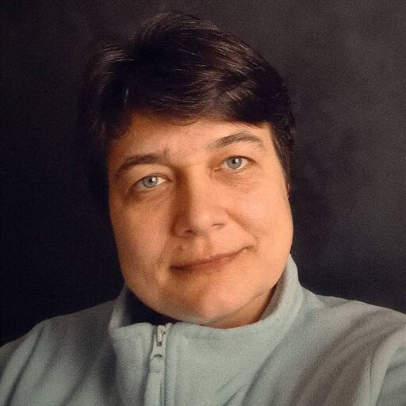
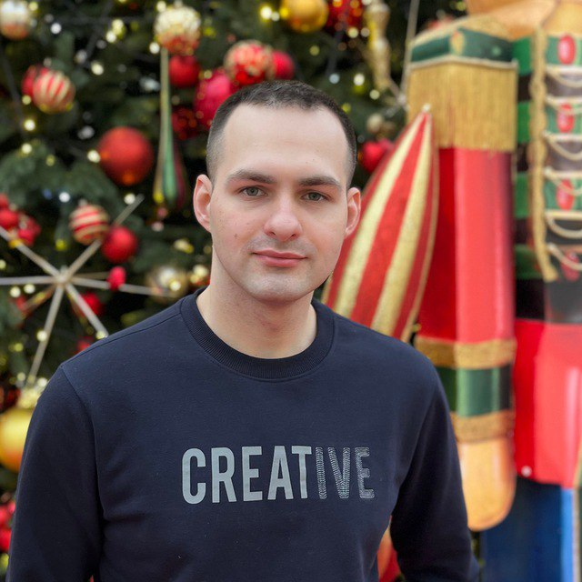
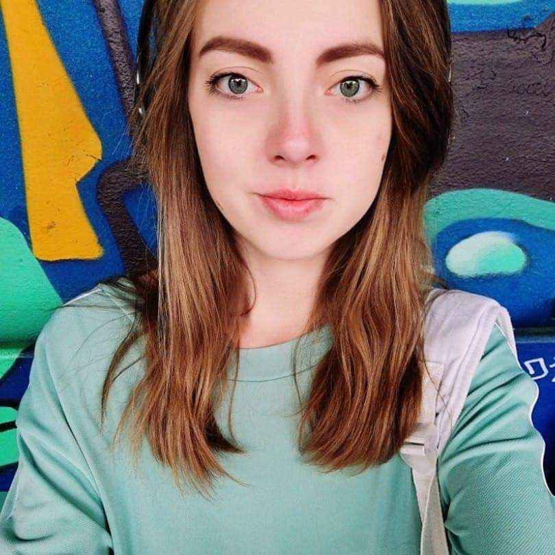
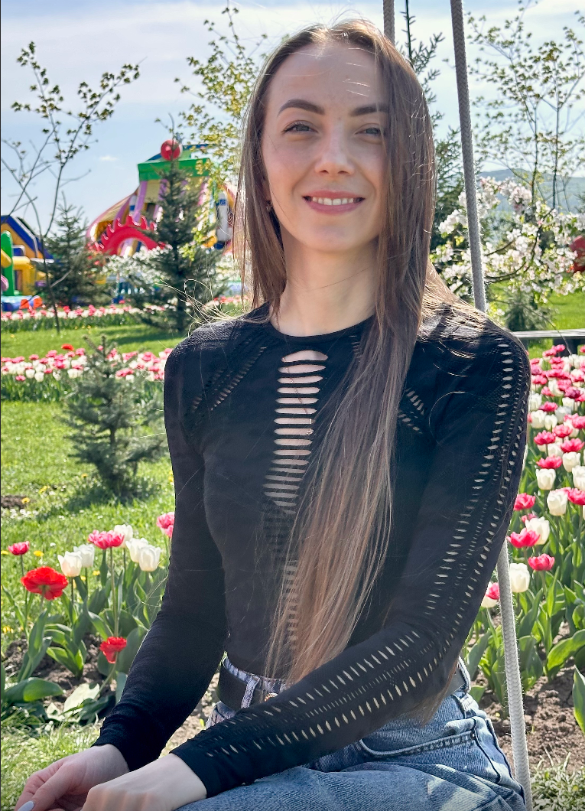
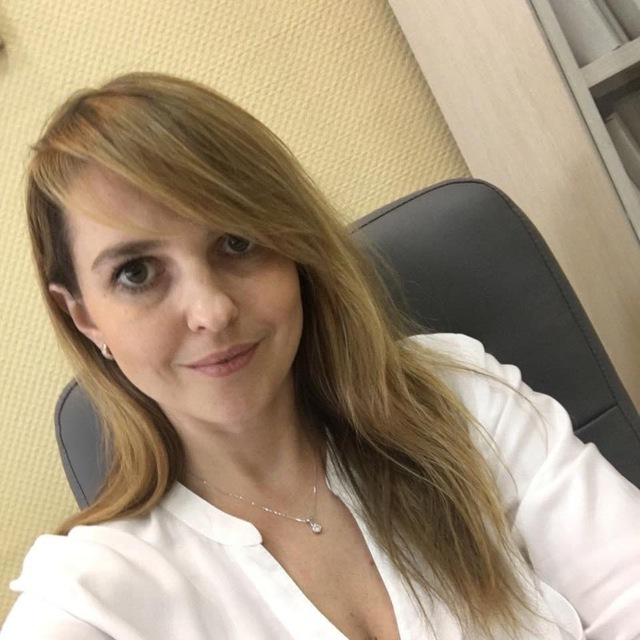
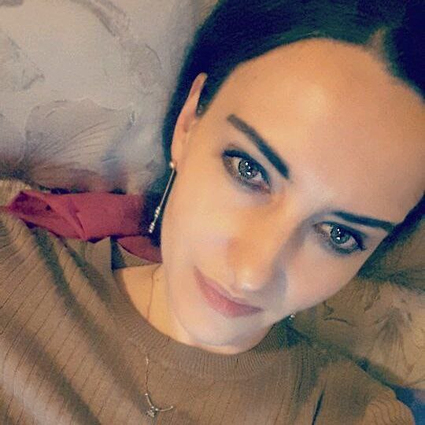
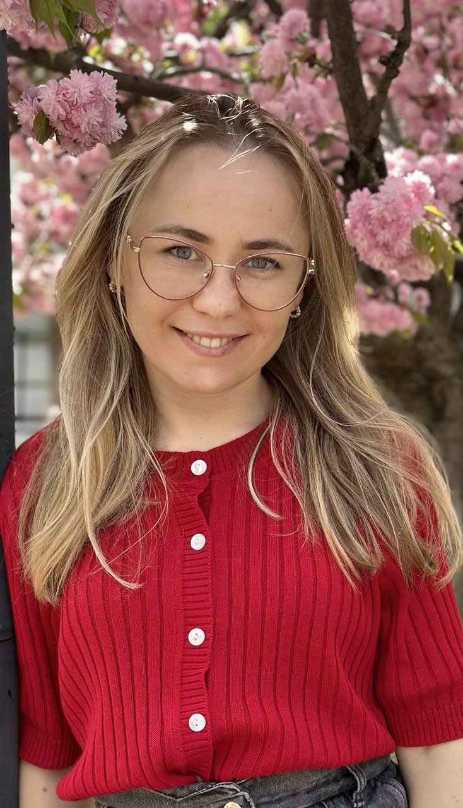

# Ласкаво просимо до "CodeGods" - ваше джерело для професійних послуг зі створення сайтів!

---

## Про команду

Ми – команда професіоналів, захоплених створенням якісного програмного забезпечення. Наша мета – розробляти інноваційні рішення та робити світ краще через технології.

`Code Gods` - це команда досвідчених веб-розробників, готових допомогти вам у створенні унікальної та ефективної онлайн-присутності для вашого бізнесу або особистого проекту. Ми прагнемо надати нашим клієнтам високоякісні послуги в галузі веб-розробки, поєднуючи креативний дизайн із передовими технологіями.
#### `Наша послуга:`
Сайт портфоліо для WEB-студій, а також для розробників, які хочуть залучити нових клієнтів

Це унікальна платформа для продажу послуг. Ми пропонуємо створення та розробку цієї платформи, яка дозволить вашим користувачам легко повідомляти вам про те, якого виду сайт
їм потрібний. Ваша спільнота зможе зростати та розвиватися, збагачуючись досвідом кожного учасника.

### `Переваги для вас:`

-  `Ефективність:` Заощаджуйте час та ресурси, надавши вашим користувачам можливість надсилати заявки безпосередньо до бази даних.
-  `Привабливий дизайн:` Ми створимо привабливий та інтуїтивно зрозумілий дизайн, який зробить використання сайту легким та приємним для ваших користувачів.
- `Технології нового покоління:` Ми використовуємо передові веб-технології та алгоритми для пошукових роботів, щоб забезпечити максимальну ефективність та зручність використання вашої платформи, а також високого індексування на пошукових платформах.

### `Наша команда:`

### 1. Владислав - `TeamLead,Scrum Muster`

  - Досвід роботи: 1 рік у розробці програмного забезпечення.
  - Спеціалізація: JS, PHP, Frond & Back-end розробка
  - Hero,Covers
### 2. - Людмила

- Досвід роботи: 6 місяців у розробці програмного забезпечення.
- Спеціалізація: фронт-енд розробка, інтерфейс користувача.
- Header

### 3. Дмитро Злагодух - `Developer`

  - Досвід роботи: 6 місяців у веб-розробці.
  - Спеціалізація: фронтенд-розробка, інтерфейс користувача.
  - About me

### 4. - Жанна Ткачук `Developer`

  - Досвід роботи: 6 місяців у веб-розробці.
  - Спеціалізація: фронтенд-розробка, інтерфейс користувача.
  - Skill list

### 5. Анна Кордубан - `Developer`

- Досвід роботи: 6 місяців у розробці програмного забезпечення.
- Спеціалізація: фронт-енд розробка, інтерфейс користувача.
- Benefits

### 6. Наталія Дорошко - `Developer`

- Досвід роботи: 6 місяців у розробці програмного забезпечення.
- Спеціалізація: фронт-енд розробка, інтерфейс користувача.
- Projects

### 7. Вікторія Колеснік - `Developer`

- Досвід роботи: 6 місяців у розробці програмного забезпечення.
- Спеціалізація: фронт-енд розробка, інтерфейс користувача.
- FAQ

### 8. Олена Панфутова - Розробник

- Досвід роботи: 6 місяців у розробці програмного забезпечення.
- Спеціалізація: фронт-енд розробка, інтерфейс користувача.
- Review

### 9. Анастасія Мегей - Розробник

- Досвід роботи: 6 місяців у розробці програмного забезпечення.
- Спеціалізація: фронт-енд розробка, інтерфейс користувача.
- Work together

**Завітайте до нас для отримання додаткової інформації та огляду наших робіт. Зв'яжіться з нами сьогодні, щоб почати створення вашої власної платформи та отримайте нових клієнтів**
